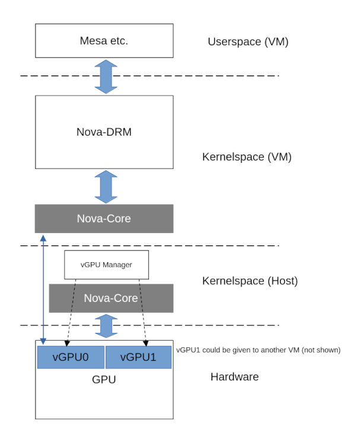

# Nova GPU Driver

Nova is a driver for GSP (GPU system processor) based Nvidia GPUs. It is
intended to become the successor of Nouveau as the mainline driver for Nvidia
(GSP) GPUs in Linux.

It will support all Nvidia GPUs beginning with the GeForce RTX20 (Turing family)
series and newer.

## Contact

Available communication channels are:

- The mailing list: nouveau@lists.freedesktop.org
- IRC: #nouveau on OFTC
- [Zulip Chat](https://rust-for-linux.zulipchat.com/#narrow/channel/509436-Nova)

## Resources

The parts that are already in mainline Linux can be found in
`drivers/gpu/nova-core/` and `drivers/gpu/drm/nova/`

The development repository for the in-tree driver is located on
[Freedesktop](https://gitlab.freedesktop.org/drm/nova).

## Background

### Why a new driver?

Nouveau was, for the most part, designed for pre-GSP hardware. The driver exists
since ~2009 and its authors back in the day had to reverse engineer a lot about
the hardware's internals, resulting in a relatively difficult to maintain
codebase.

Moreover, Nouveau's maintainers concluded that a new driver, exclusively for
GSP hardware, would allow for significantly simplifying the driver design: Most
of the hardware internals that Nouveau had to reverse engineer reside in the
GSP firmware. Hereby, the GSP takes up the role of a hardware abstraction layer
which communicates with the host kernel through IPC. Thereby, a lot of the
stack's complexity is moved from the GPU driver into the GSP firmware.

This, in consequence, enables better maintainability. Another chance with a new
driver is to obtain active community participation from the very beginning.

### Why write it in Rust?

Besides Rust's built-in ownership and lifetime model, its powerful type system
allows us to avoid a large portion of a whole class of bugs (i.e. memory safety
bugs).

Additionally, the same features allow us to model APIs in a way that also
certain logic errors can be caught at compile time already.

Especially GPU drivers can benefit a lot from Rust's ownership and lifetime
model, given their highly concurrent and asynchronous design.

Since Nova is a new driver, written from scratch, it is an opportunity to try to
leverage the advantages of Rust and obtain a more reliable, maintainable driver.

## Architecture

The overall GPU driver is split into two parts:

1. "Nova-Core", living in `drivers/gpu/nova-core/`. Nova-Core implements
   the fundamental interaction with the hardware (through PCI etc.) and,
   notably, boots up the GSP and interacts with it through a command queue.
2. "Nova-DRM" (the official name is actually just "Nova", but to avoid
   confusion developers usually call it "Nova-DRM"), living in
   `drivers/gpu/drm/nova/`. This is the actual graphics driver,
   implementing all the typical DRM interfaces for userspace.

This split architecture allows for different drivers building on top of the
abstraction layer provided by Nova-Core. Besides Nova-DRM, for instance, a VFIO
driver to virtualize the GPU can be built on top of Nova-Core. Through this
driver Nova-Core can be used to instruct the GPU's firmware to spawn new PCI
virtual functions (through
[SR-IOV](https://docs.kernel.org/PCI/pci-iov-howto.html)), representing virtual
GPUs. Those virtual functions (or vGPUs) can be used by virtual machines. Such
a virtual machine running Linux may run Nova-Core and Nova-DRM as conventional
GPU drivers on top of this vGPU.

A main advantage of this design is that the amount of software running on the
host (where crashes would be far more fatal than inside of a VM) is kept small,
which contributes to stability.

It is also possible to use Nova-Core + Nova-DRM on one physical machine (not
depicted in the diagram) in order to expose a DRM compatible uAPI to the host
userspace.

For more details about vGPUs, take a look at
[Zhi's announcement email](https://lore.kernel.org/nouveau/20240922124951.1946072-1-zhiw@nvidia.com/).

## Status and Contributing

The necessary Rust infrastructure has been progressing a lot. Current work now
focuses more on the actual driver. In case you want to contribute, take a look
at the
[NOVA TODO List](https://docs.kernel.org/gpu/nova/core/todo.html).

Don't hesitate reaching out on the aforementioned community channels.
